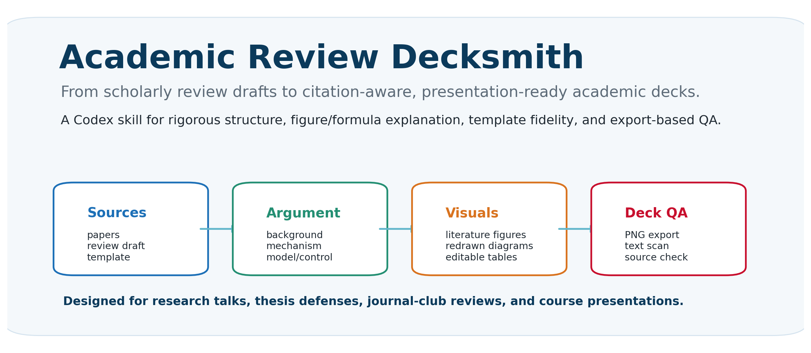
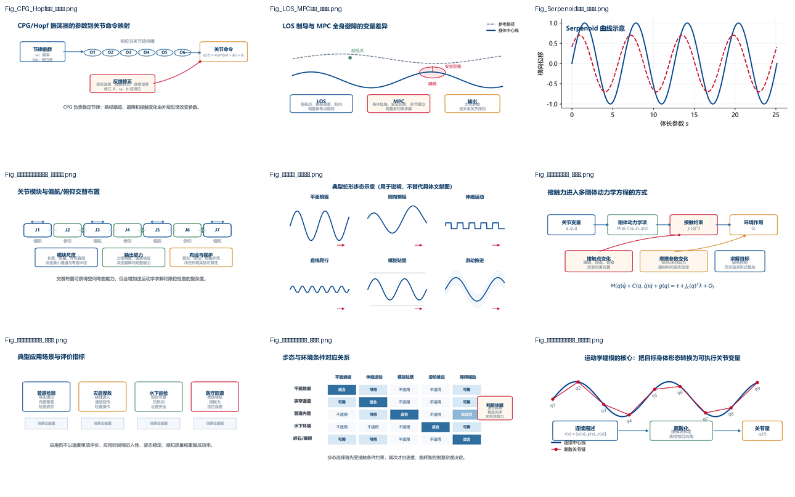
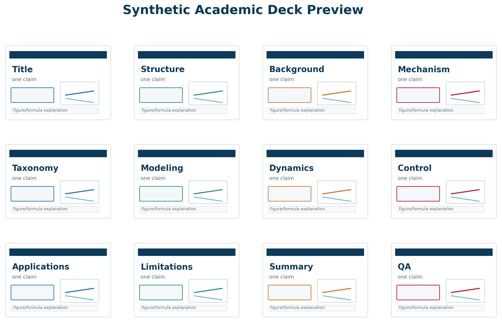

# Academic Review Decksmith

> Convert scholarly review drafts, paper folders, and PPT templates into rigorous, citation-aware academic presentations.




.png)



**Academic Review Decksmith** is a reusable Codex skill for turning dense literature reviews into clean, defensible academic slide decks. It was distilled from a real end-to-end workflow: reading core papers, rebuilding the review argument, selecting source figures, redrawing method diagrams, explaining formulas, preserving a university-style PPT template, and exporting slides for visual QA.

It is designed for thesis defenses, journal-club reports, course presentations, research group meetings, and review talks where "pretty slides" are not enough. The deck must be structurally rigorous, traceable to sources, and understandable to an expert audience.

## Why This Exists

Most AI-generated academic slides fail in predictable ways:

| Common failure | Decksmith rule |
| --- | --- |
| Mechanical chapter-by-chapter slides | Rebuild the technical argument |
| Vague trend words and inflated transitions | Tie every claim to a mechanism, variable, method, or metric |
| Figures pasted without explanation | Add visible read-the-figure notes |
| Equations shown as decoration | Explain variables, terms, and engineering meaning |
| Fake-looking flowcharts and icons | Use literature figures, editable PPT components, or controlled redrawn diagrams |
| Unchecked PPT layout | Export every slide to PNG and inspect before delivery |

## Demo Gallery

The repository can include real effect previews and reusable templates:

| Academic deck preview | Figure system preview |
| --- | --- |
|  |  |

The deck preview is a public-safe synthetic overview. The figure preview uses redrawn academic diagrams from a robotics review workflow. The method is domain-general: it can be reused for robotics, mechanical engineering, materials, biomedical engineering, AI systems, and other research-heavy topics.

## Core Workflow

```mermaid
flowchart LR
    accTitle: Academic Review Deck Workflow
    accDescr: The workflow starts from papers, drafts, and templates, then rebuilds the academic argument, handles figures and formulas, creates a deck, and verifies it through export-based QA.

    sources["Sources<br/>papers, review draft, template"]
    map["Source Map<br/>figures, formulas, platforms, evidence"]
    argument["Academic Argument<br/>background -> mechanism -> model -> control"]
    visuals["Visual System<br/>literature figures + redrawn diagrams + editable tables"]
    deck["PPTX Deck<br/>template fidelity + concise slide claims"]
    qa["QA Loop<br/>PNG export + text scan + figure-source check"]

    sources --> map --> argument --> visuals --> deck --> qa
    qa -. fix layout/content .-> deck
```



## What The Skill Produces

- A logically reorganized academic deck, not a direct dump of paper summaries.
- Source-aware figure captions using author-year or figure-source labels.
- Controlled visual categories: literature figure, redrawn academic diagram, editable PPT component, generated text-free schematic.
- Short explanation boxes for important figures, formulas, and tables.
- Exported slide previews for visual inspection.
- Text scans to remove process notes and AI-like filler.

## Repository Contents

```text
academic-review-decksmith/
├── SKILL.md                         # Codex skill instructions
├── README.md                        # GitHub-facing project overview
├── GITHUB_LISTING.md                # star-friendly title, About, and keyword ideas
├── agents/
│   └── openai.yaml                  # optional Codex UI metadata
├── assets/
│   ├── gallery/                     # README screenshots and overview images
│   ├── templates/                   # reusable PPT templates or sample shells
│   └── figures/                     # reusable academic diagram examples
├── references/
│   ├── academic_review_deck_workflow.md
│   ├── figure_formula_guidelines.md
│   └── review_language_rules.md
└── scripts/
    ├── make_overview_assets.py
    └── scan_ppt_text.py
```

## Quick Start

Copy this folder into your Codex skills directory:

```bash
cp -R academic-review-decksmith ~/.codex/skills/
```

Then ask Codex something like:

```text
Use Academic Review Decksmith. Create a 30-minute academic presentation from this review draft,
the papers folder, and this PPT template. Preserve the template style, explain key figures and
formulas, avoid process notes, and export PNG previews for QA.
```

For Windows, copy the folder to:

```text
C:\Users\<you>\.codex\skills\academic-review-decksmith
```

## Example Prompts

```text
基于这篇综述初稿和 papers 文件夹，按我的 PPT 模板重构一份 30 页左右的学术汇报。
重点讲清楚研究背景、机理、结构、建模、控制和应用。所有重要图片和公式都要给出读图/公式含义说明。
```

```text
Polish this literature-review presentation for a PhD-level audience.
Remove generic AI wording, make figures source-aware, add formula explanation boxes,
and export a contact sheet for visual QA.
```

```text
Turn this journal-style review outline into a template-consistent PPT.
Use literature figures for real experiments, redraw workflows as editable diagrams,
and keep each slide centered on one technical claim.
```

## Design Philosophy

Decksmith treats academic slides as a compact research argument:

- **Structure decides the narrative.** Background and related work should lead into mechanism and method, not remain a list of papers.
- **Figures carry evidence.** A platform photo, experiment sequence, or model diagram should answer a specific claim.
- **Formulas require translation.** Expert audiences still need to know what each term does in the system.
- **QA is part of authorship.** If a deck has not been exported and inspected, it is not finished.

## Included Gallery And Templates

Recommended assets to keep in the repo:

- `assets/gallery/project-overview.png`: high-level workflow banner.
- `assets/gallery/snake-robot-demo-overview.png`: public-safe synthetic full-deck preview.
- `assets/gallery/academic-figures-overview.png`: figure-system preview.
- `assets/templates/academic-template.pptx`: public-safe sample academic PPT template.
- `assets/templates/sample-output.pptx`: optional private example output deck, not included in the public-safe release by default.

If you publish this repository publicly, ensure that any copied paper figures, university logos, or course templates are permitted to share. When licensing is unclear, keep only synthetic/redrawn examples in the public repo and document how users can add their private templates locally.

## Roadmap

- Add a command-line PPT export helper for PowerPoint and LibreOffice.
- Add citation manifest generation for figures and formulas.
- Add bilingual Chinese/English slide wording presets.
- Add journal-specific visual profiles for robotics, mechanical engineering, biomedical engineering, and AI systems.
- Add automated slide-density and overflow scoring.

## License

MIT. Use it, adapt it, and make academic decks less painful.
